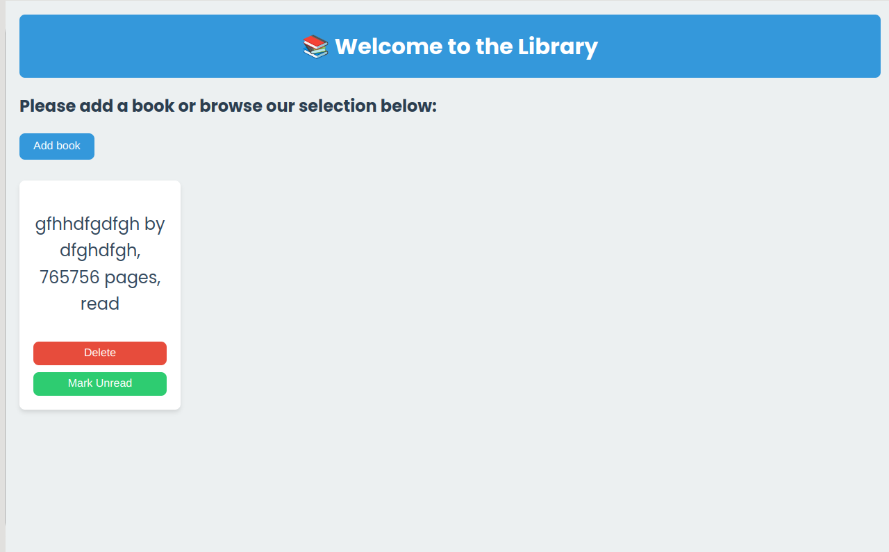

# My Book Library

This is a simple application that allows users to manage a personal book library. Users can add books, delete them, and mark them as read or unread.

## Features

- Add new books with title, author, number of pages, and read status.
- Delete books from the library.
- Toggle the read status of each book.

## Screenshot

## Usage

1. Clone the repository.
2. Open `index.html` in your web browser.
3. Use the form to add books to your library.
4. Manage your books using the provided buttons.

## Technologies Used

- HTML
- CSS
- JavaScript

